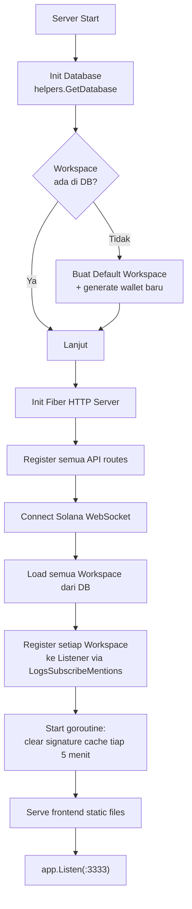
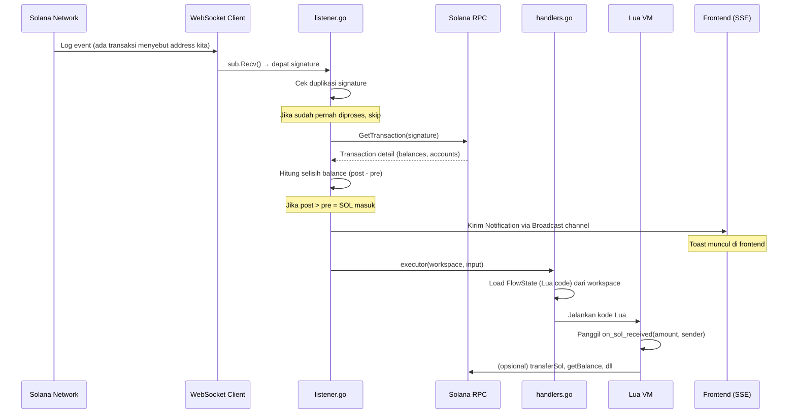
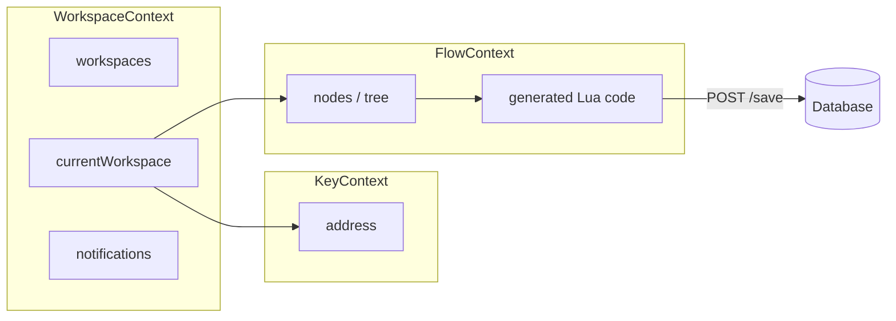
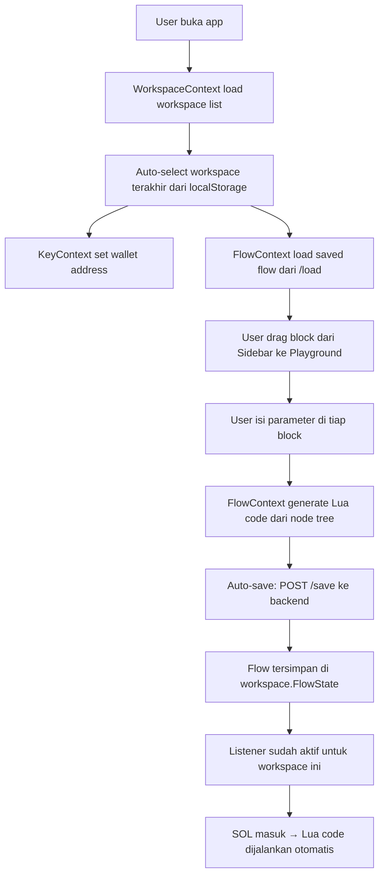
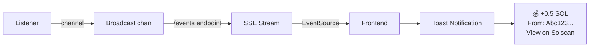

# Panon — Arsitektur & Alur Kode

Panon adalah platform otomasi transaksi Solana berbasis **no-code builder**. User membuat flow otomasi secara visual di frontend, yang kemudian dikonversi ke Lua dan dieksekusi otomatis oleh backend saat transaksi masuk terdeteksi.

---

## Struktur Direktori

```
panon/
├── main.go                          # Entry point aplikasi
├── database.db                      # SQLite database (auto-generated)
├── internal/
│   ├── handlers/handlers.go         # HTTP API handlers (Fiber)
│   ├── helpers/database.go          # Database helper (GORM + SQLite)
│   ├── listener/listener.go         # Solana WebSocket listener
│   ├── models/
│   │   ├── workspace.go             # Model: Workspace
│   │   ├── wallet.go                # Model: Wallet
│   │   └── notification.go          # Model: Notification & ExecutorInput
│   ├── luaexec/                     # (reserved) Lua execution helpers
│   └── wallet/                      # Wallet file manager (legacy)
├── panon/
│   └── panon.go                     # Solana SDK — fungsi Lua (transfer, balance, dll)
└── frontend/
    └── src/
        ├── App.tsx                   # Root component
        ├── context/
        │   ├── WorkspaceContext.tsx   # State: workspace, notifikasi, SSE
        │   ├── KeyContext.tsx         # State: wallet address aktif
        │   └── FlowContext.tsx        # State: node builder, code generation
        ├── components/
        │   ├── Header.tsx            # Header bar + workspace selector
        │   ├── Sidebar.tsx           # Panel kiri: daftar block/node
        │   ├── Playground.tsx        # Canvas drag-and-drop
        │   ├── WorkspaceSelector.tsx # Dropdown pilih/buat/rename workspace
        │   ├── CodeModal.tsx         # Modal preview kode Lua
        │   ├── KeyModal.tsx          # Modal pengaturan wallet
        │   └── Fields.tsx            # Input fields untuk node
        └── nodes/
            ├── BaseNode.tsx          # Base node, recursive children
            ├── OnSolReceived.tsx     # Trigger: SOL masuk
            ├── OnUSDCReceived.tsx    # Trigger: USDC masuk
            ├── ActionNodes.tsx       # Action: Transfer SOL/Token
            ├── ComputeNodes.tsx      # Compute: Get Balance, dll
            ├── ControlNodes.tsx      # Control: If/Else
            └── GetSolBalance.tsx     # Node: cek saldo SOL
```

---

## Alur Startup (`main.go`)



**Penjelasan:**
1. Database SQLite di-init dan tabel di-migrate otomatis via GORM
2. Jika belum ada workspace, buat satu "Default Workspace" dengan wallet baru
3. Fiber HTTP server disiapkan dengan CORS
4. Semua API route di-register
5. WebSocket ke Solana devnet dibuka
6. Semua workspace yang ada di DB di-subscribe ke WebSocket listener
7. Goroutine pembersih cache signature dijalankan (mencegah duplikasi)
8. Frontend static files dan SPA catch-all route diaktifkan

---

## Database Models

```
┌─────────────────────────┐       ┌────────────────────┐
│       Workspace         │       │       Wallet       │
├─────────────────────────┤       ├────────────────────┤
│ ID         uint (PK)    │──────▶│ ID         uint    │
│ Name       string       │       │ PrivateKey string  │
│ WalletID   uint (FK)    │       │ CreatedAt  time    │
│ FlowState  text (JSON)  │       │ UpdatedAt  time    │
│ CreatedAt  time         │       └────────────────────┘
│ UpdatedAt  time         │
│ DeletedAt  time (soft)  │
└─────────────────────────┘
```

- Setiap **Workspace** memiliki tepat satu **Wallet**
- **FlowState** menyimpan JSON berisi `code` (Lua) dan `flow` (node tree) dari builder
- Workspace tidak bisa dihapus, hanya bisa di-rename

---

## API Endpoints

| Method | Path | Handler | Deskripsi |
|--------|------|---------|-----------|
| `GET` | `/workspaces` | `ListWorkspaces` | Daftar semua workspace |
| `GET` | `/workspace/:id` | `GetWorkspace` | Detail workspace + wallet address |
| `POST` | `/workspace` | `CreateWorkspace` | Buat workspace baru (auto-generate wallet) |
| `PUT` | `/workspace/:id` | `UpdateWorkspace` | Rename workspace |
| `POST` | `/save` | `SaveFlow` | Simpan flow (Lua code + node tree) ke DB |
| `GET` | `/load?workspaceId=` | `LoadFlow` | Load flow dari DB |
| `POST` | `/derive-address` | `DeriveAddress` | Derive public address dari private key |
| `GET` | `/wallets` | `ListWallets` | Daftar semua wallet + address |
| `GET` | `/events` | `HandleEvents` | SSE stream untuk notifikasi real-time |

---

## Alur Transaksi Masuk (Listener)

Ini adalah inti dari Panon — apa yang terjadi saat SOL masuk ke wallet workspace.



**Detail langkah-langkah:**

1. **WebSocket menerima event** — `LogsSubscribeMentions` mem-filter hanya log yang menyebut public key workspace kita
2. **De-duplikasi** — Signature dicek di map `processedSignatures`. Jika sudah ada, skip. Map ini di-clear setiap 5 menit
3. **Fetch detail transaksi** — RPC `GetTransaction` dipanggil (dengan retry 3x) untuk mendapat data balance
4. **Hitung selisih** — `PreBalances` vs `PostBalances` menentukan apakah SOL masuk atau keluar
5. **Notifikasi** — Data transaksi dikirim ke channel `Broadcast`, yang di-stream ke frontend via SSE
6. **Eksekusi Lua** — `ExecuteLuaTrigger` mem-parse `FlowState` workspace, membuat Lua VM baru, dan menjalankan fungsi `on_sol_received(amount, sender)`

---

## Alur Frontend

### Component Tree

```
App
├── WorkspaceProvider (context)     ← kelola workspace + SSE notifications
│   ├── KeyProvider (context)       ← simpan wallet address aktif
│   │   ├── FlowProvider (context)  ← kelola node tree + generate Lua code
│   │   │   ├── Sidebar             ← panel blok yang bisa di-drag
│   │   │   ├── Header              ← workspace selector + action buttons
│   │   │   └── Playground          ← canvas untuk drop & arrange blok
```

### State Management



### Alur User Membuat Automation



---

## Panon SDK (`panon/panon.go`)

SDK ini menyediakan fungsi-fungsi Solana yang bisa dipanggil dari Lua:

| Fungsi Lua | Deskripsi | Parameter | Return |
|-----------|-----------|-----------|--------|
| `getBalance(address)` | Cek saldo SOL | address (string) | balance (number, dalam SOL) |
| `transferSol(to, amount)` | Kirim SOL | to, amount (dalam SOL) | signature |
| `transfer(to, tokenOrSOL, amount)` | Unified transfer | to, "SOL" atau mint address, amount | signature |
| `getTokenBalance(owner, mint)` | Cek saldo SPL token | owner, mint | amount, decimals |
| `transferToken(to, mint, amount)` | Kirim SPL token | to, mint, amount (raw) | signature |
| `createTokenAccount(owner, mint)` | Buat ATA | owner, mint | signature, ata address |
| `mintTokens(to, mint, amount)` | Mint SPL token | to, mint, amount (raw) | signature |

**Variabel global Lua yang tersedia saat eksekusi:**

| Variable | Isi |
|----------|-----|
| `rpcUrl` | URL RPC Solana |
| `privateKey` | Private key workspace aktif |
| `my_address` | Public address workspace aktif |

---

## Real-time Notifications (SSE)



- Backend menggunakan **Server-Sent Events** (unidirectional, server → client)
- Frontend membuka `EventSource` ke `/events` saat mount
- Notifikasi muncul untuk transaksi di **semua workspace**, bukan hanya yang aktif
- Toast auto-remove setelah 5 detik, max 5 notifikasi ditampilkan

---

## Ringkasan Tech Stack

| Layer | Teknologi |
|-------|-----------|
| **Backend** | Go, Fiber v2, GORM, SQLite |
| **Solana** | gagliardetto/solana-go (RPC + WebSocket) |
| **Scripting** | gopher-lua (Lua VM embedded di Go) |
| **Frontend** | React, Vite, TypeScript, Tailwind CSS |
| **Realtime** | Server-Sent Events (SSE) |
| **Database** | SQLite via GORM (auto-migrate) |
